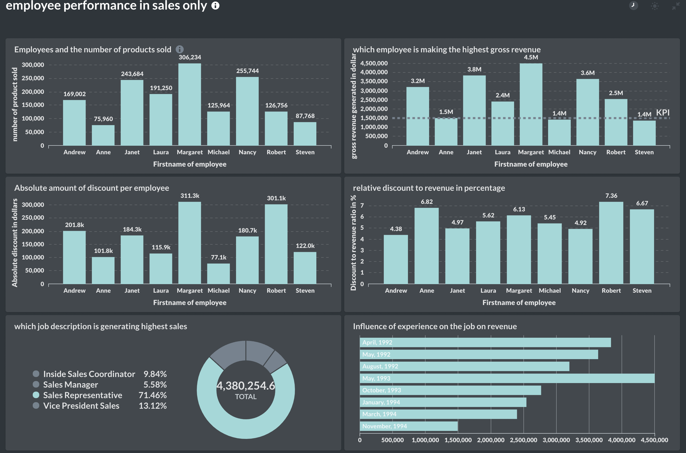

# Dashboard-employee-data-analysis

This is a small project to analyse the employee performace in sales of products using northwind dataset. 

From the data, it is obvious that Margaret is the employee with the highest number of products sold as well as the gross revenew.
Interestingly, whereas shes is selling more product, she is giving less discounts when the discount is considered relative to the total revenue she is generating. 
By contrasts, Steven is is not meeting the revenue target but he is giving the highest one of the highest discount when the discount is considered relative to the total revenue he generated. 

As it is expected, when job description is considered, sales representatives are making the most sales. What is striking is that the sales managers are making less sales than the vice presidents of sales that I believe may be saddled with many administrative responsibitilies

Lastly, I tried to see if the data of employement has any influence of perfomance. Although there seems to be some trend, which is only distrupted by May 1993, I consider this trend an artifact that holds no true meaning because of the proximity of the employment dates

I certainly had fun making the SQL queries and data analysis and I hope to analyse the product information in the nearest future and derive more insights into the company products and their orders

### Tech Stack

SQL, Postgress, AWS(temporarily used EC2 machine virtual machine to host the Postgress database), Metabase for query and data analysis

